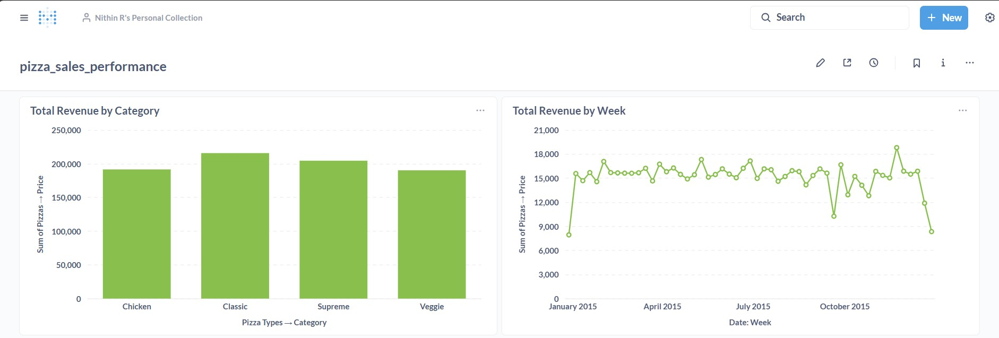

# Pizza Sales Analysis & BI Dashboard

## Objective
This project was built to analyze the sales data of a pizza restaurant, matching the requirements for a Data Analyst internship. The goal was to perform data analysis using SQL and build an interactive, shareable dashboard for non-technical stakeholders using Metabase.

## Tech Stack
* **Database:** PostgreSQL
* **Querying:** SQL
* **Analysis:** Python, Pandas, SQLAlchemy
* **Dashboarding:** Metabase

## Final Dashboard
Here are screenshots of the final Metabase dashboard, visualizing key performance indicators (KPIs) for the business.

### Dashboard Overview

## Key Insights from the Dashboard
* **Busiest Time:** The busiest hours for orders are 12:00 PM and 5:00 PM - 6:00 PM (from the "Total Orders by Hour" chart).
* **Top Category:** The "Classic" category is the most popular, driving the most revenue (from the "Sales by Category" chart).
* **Top Pizza:** The "Classic Deluxe Pizza" is the single best-selling item by quantity (from the "Top 5 Best-Sellers" chart).
* **Sales Trend:** Sales are highest in July and November (from the "Total Revenue by Month" chart).
